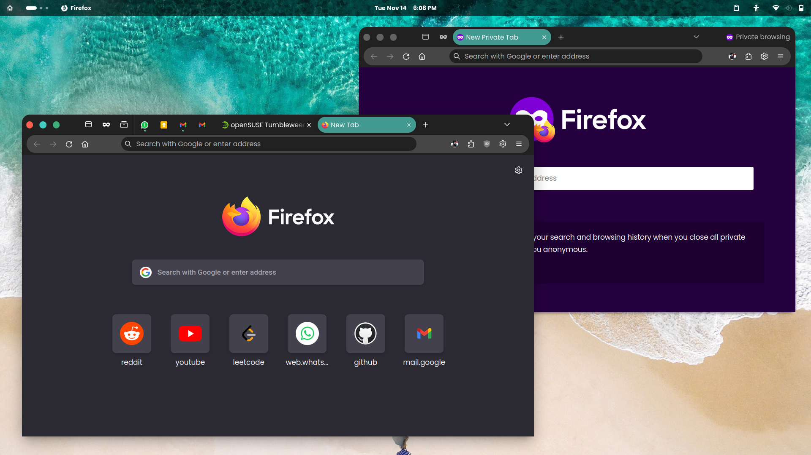

This theme is my spin on [migueravila's](https://github.com/migueravila) [SimpleFox](https://github.com/migueravila/SimpleFox) theme. 
Using Teal color palette.

 

 

## Installation/Setup
1. Go to `about:config` and Set these flags true:
    - **`toolkit.legacyUserProfileCustomizations.stylesheets`**
    - **`layers.acceleration.force-enabled`**
    - **`gfx.webrender.all`**
    - **`svg.context-properties.content.enabled`**
2. Go to your Firefox profile:
    - If you're on Linux: `$HOME/.mozilla/firefox/XXXXXXX.default-release/`
    - If you're on Windows: `C:\Users\<USERNAME>\AppData\Roaming\Mozilla\Firefox\Profiles\XXXXXXX.default-XXXXXX`
    - If you're on MacOS: `Users/<USERNAME>/Library/Application Support/Firefox/Profiles/XXXXXXX.default-XXXXXXX` 
3. Create an folder named `chrome` into this directory (if not already exists).
4. Copy all the repo contents into `chrome` folder.
5. Make all the customizations you want.
6.Enjoy!